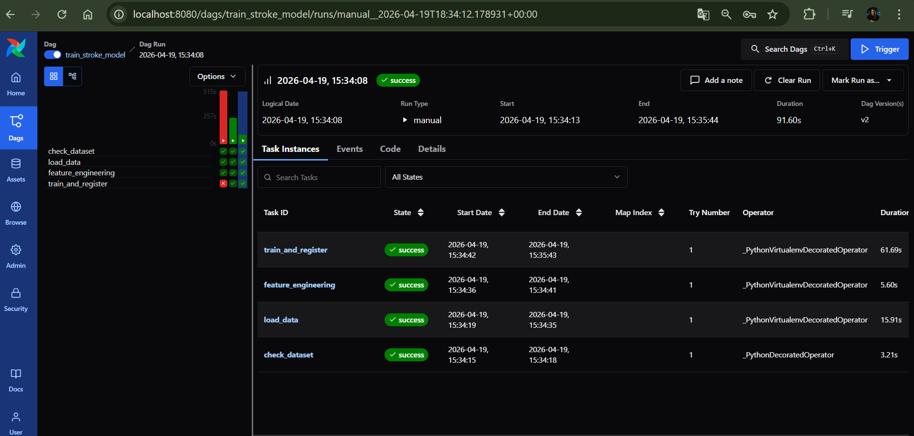
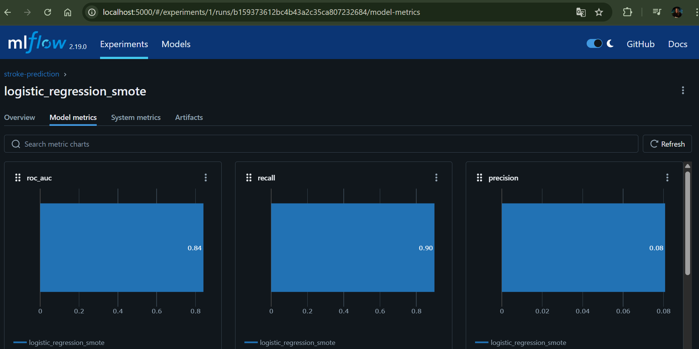
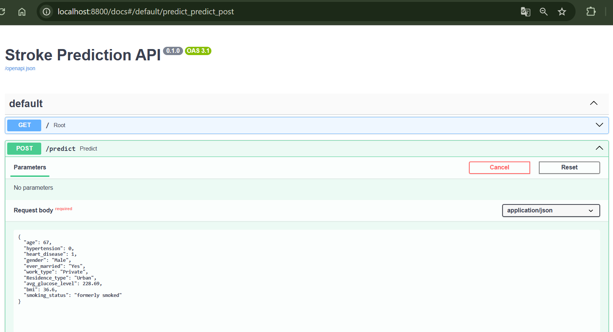
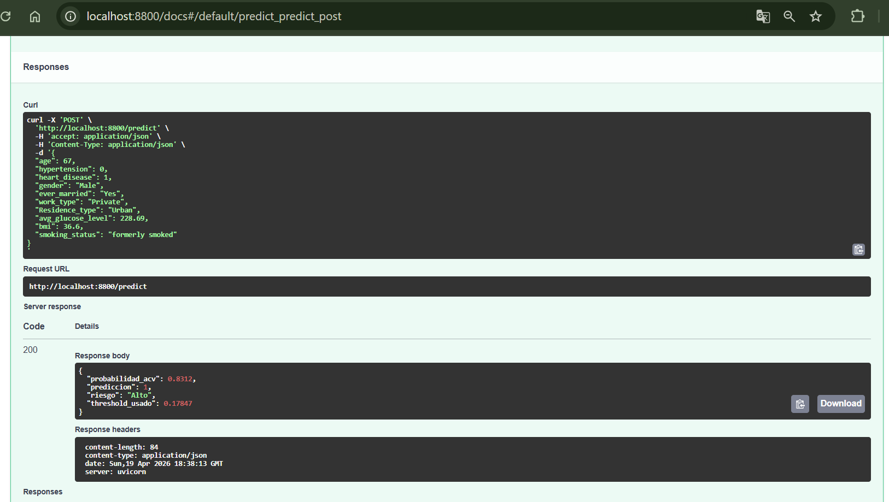

<h1>Predicción de ACV</h1>

TP Final de la materia MLOps — Posgrado en Inteligencia Artificial (CEIA, UBA)

Pipeline end-to-end para predecir la probabilidad de accidente cerebrovascular (ACV/stroke) usando Regresión Logística con SMOTE

 

<h2>Integrantes</h2>

Mauro Virgilio Blanc 
Juan Pablo Imbrogno 
Sofía Belén Caselli 
Miguel Angel Leiva Martinez 
Andrea Viviana Ferenaz

 

<h2>Arquitectura</h2>

<pre>
MinIO (s3)   <- dataset de entrada (bucket: data)
     |
Airflow      <- orquesta el pipeline de entrenamiento (DAG: train_stroke_model)
     |
MLflow       <- registra experimentos y versiona el modelo (bucket: mlflow)
     |
FastAPI      <- sirve predicciones en tiempo real (puerto 8800)
</pre>

Servicios de soporte: PostgreSQL (backend de Airflow y MLflow), Redis (broker de Celery)

 

<h2>Stack tecnológico</h2>

<table align="center">
<tr>
<th>Servicio</th>
<th>Imagen / Framework</th>
<th>Puerto</th>
</tr>

<tr><td>Airflow</td><td>custom (CeleryExecutor)</td><td>8080</td></tr>
<tr><td>MLflow</td><td>custom</td><td>5000</td></tr>
<tr><td>MinIO</td><td>minio/minio:latest</td><td>9000 / 9001</td></tr>
<tr><td>FastAPI</td><td>custom (uvicorn)</td><td>8800</td></tr>
<tr><td>PostgreSQL</td><td>custom</td><td>5432</td></tr>

</table>

 

<h2>Requisitos previos</h2>

Docker &gt;= 24 
Docker Compose &gt;= 2.20 
Al menos 4 GB de RAM y 10 GB de disco disponibles para Docker

<pre>
echo "AIRFLOW_UID=$(id -u)" >> .env
</pre>

 

<h2>Despliegue paso a paso</h2>

<b>1. Clonar el repositorio</b>

<pre>
git clone &lt;https://github.com/maurovirgilioblanc-cmd/TP_MLOP&gt;
cd ceia-mlops
</pre>

<b>2. Construir y levantar servicios</b>

<pre>
docker compose --profile all up --build -d
</pre>

Esto levanta todos los servicios. Esperar 2-3 minutos.

<b>3. Cargar dataset en MinIO</b>

<pre>
docker cp data/stroke-data.csv minio:/tmp/stroke-data.csv
docker exec minio mc alias set local http://localhost:9000 minio minio123
docker exec minio mc cp /tmp/stroke-data.csv local/data/stroke-data.csv
</pre>

Alternativa: http://localhost:9001 (minio / minio123)

<b>4. Ejecutar DAG</b>

http://localhost:8080 
Usuario: airflow 
Password: airflow

Activar train_stroke_model y ejecutar hasta success

<b>5. Reiniciar API</b>

<pre>
docker compose restart fastapi
</pre>

Solo necesario la primera vez

 

<h2>Servicios y URLs</h2>

<table align="center">
<tr>
<th>Servicio</th>
<th>URL</th>
<th>Credenciales</th>
</tr>

<tr><td>Airflow</td><td>http://localhost:8080</td><td>airflow / airflow</td></tr>
<tr><td>MLflow</td><td>http://localhost:5000</td><td>-</td></tr>
<tr><td>MinIO</td><td>http://localhost:9001</td><td>minio / minio123</td></tr>
<tr><td>FastAPI</td><td>http://localhost:8800/docs</td><td>-</td></tr>

</table>

 

<h2>Uso de la API</h2>

<pre>
curl http://localhost:8800/
</pre>

<pre>
curl -X POST http://localhost:8800/predict \
-H "Content-Type: application/json" \
-d '{
  "age": 67,
  "hypertension": 0,
  "heart_disease": 1,
  "gender": "Male",
  "ever_married": "Yes",
  "work_type": "Private",
  "Residence_type": "Urban",
  "avg_glucose_level": 228.69,
  "bmi": 36.6,
  "smoking_status": "formerly smoked"
}'
</pre>

 

<h2>Respuesta</h2>

<pre>
{
  "probabilidad_acv": 0.312,
  "prediccion": 1,
  "riesgo": "Medio",
  "threshold_usado": 0.17847
}
</pre>

 

<h2>Valores válidos</h2>

gender: Male, Female, Other 
work_type: Private, Self-employed, Govt_job, children, Never_worked 
Residence_type: Urban, Rural 
smoking_status: formerly smoked, never smoked, smokes, Unknown

 

<h2>Evidencia</h2>

<b>1. DAG ejecutado en Airflow</b>

  

<b>2. Experimento registrado en MLflow</b>

  

<b>3. Respuesta del endpoint /predict</b>

  

 

<h2>Detener servicios</h2>

<pre>
docker compose --profile all down
</pre>

Para eliminar también los volúmenes (base de datos, modelos y datos en MinIO):

<pre>
docker compose --profile all down -v
</pre>

